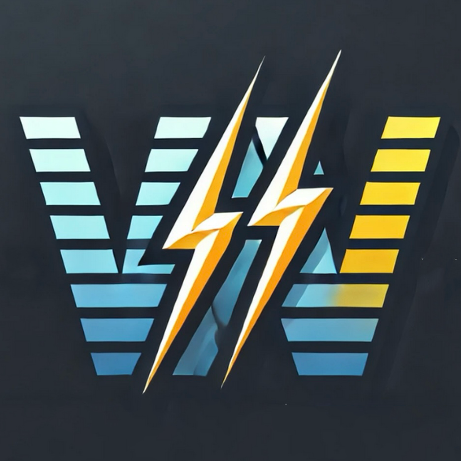

<!-- 

 -->

  
  

# Home Appliance Energy Monitoring

**Home Appliance Energy Monitoring** is a smart energy monitoring app designed to help users track and optimize household appliance energy consumption. The app provides real-time data visualization, remote appliance control, and energy-saving recommendations. It supports multiple data interaction methods, including API integration, simulated data, and manual input.

---
" alt="Home Appliance Energy Monitoring" width="150">

# Home Appliance Energy Monitoring

**Home Appliance Energy Monitoring** is a smart energy monitoring app designed to help users track and optimize household appliance energy consumption. The app provides real-time data visualization, remote appliance control, and energy-saving recommendations. It supports multiple data interaction methods, including API integration, simulated data, and manual input.

---

**Home Appliance Energy Monitoring** is a smart energy monitoring app designed to help users track and optimize household appliance energy consumption. The app provides real-time data visualization, remote appliance control, and energy-saving recommendations. It supports multiple data interaction methods, including API integration, simulated data, and manual input.

---

<!-- <h1 align="center">LFTrack: Instant, Accurate, and Secure LFT Results at Your Fingertips</h1>
<h3 align="center">Also visit <a href="https://adityojulian.github.io/LFTrack/">LFTrack microsite</a> for more info!</h3> -->

# WiseWatts

This is the Final assessment template for CASA0014 - Please use this template and edit the relevant sections to personalise.
This section has a short introduction to what the application is

## Use this README File 

Use this section to show us what your Mobile App is about.   Include a Screenshot to the App, link to the various frameworks you've used. Include your presentation video here that shows off your Mobile App.   Emojis are also fun to include 📱 😄

Look at some other Flutter Apps online and see how they use there README File.  Good examples are:

- https://github.com/miickel/flutter_particle_clock
- https://github.com/Tarikul711/flutter-food-delivery-app-ui    
- https://github.com/mohak1283/Instagram-Clone

## Include A Section That Tells Developers How To Install The App

Include a section that gives intructions on how to install the app or run it in Flutter.  What versions of the plugins are you assuming?  Maybe define a licence

##  Contact Details

Having Contact Details is also good as it shows people how to get in contact with you if they'd like to contribute to the app. 
